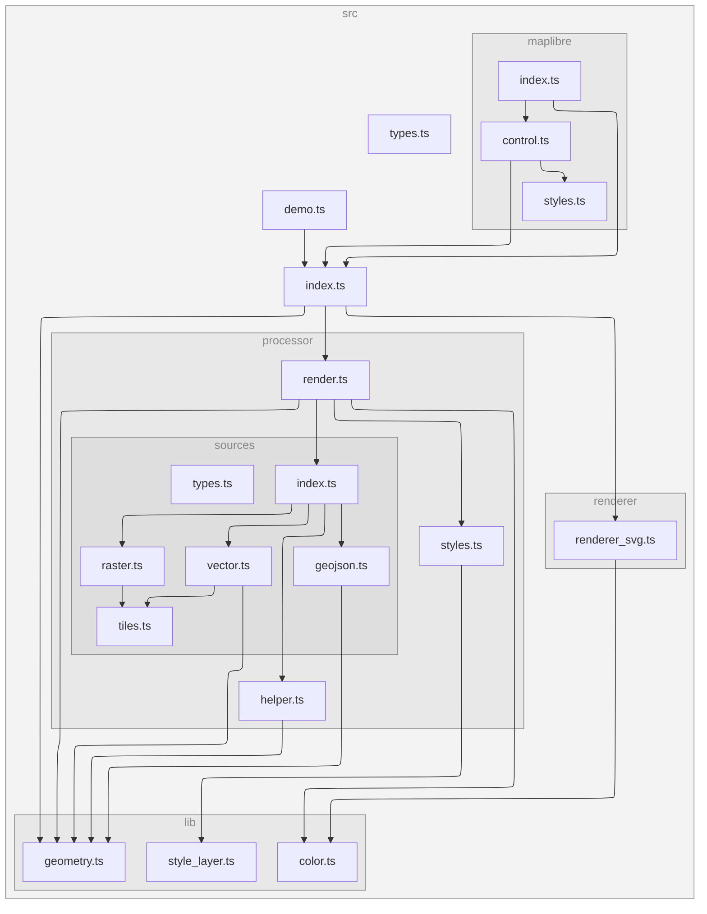

[](https://www.npmjs.com/package/@versatiles/svg-renderer)
[](https://www.npmjs.com/package/@versatiles/svg-renderer)
[](https://codecov.io/gh/versatiles-org/versatiles-svg-renderer)
[](https://github.com/versatiles-org/versatiles-svg-renderer/actions/workflows/ci.yml)
[](LICENSE)

# VersaTiles SVG Renderer

Renders vector maps as SVG.


[Download SVG](docs/demo.svg)

Currently supported layer types: background, fill, line, and raster.

## Installation

```bash
npm install @versatiles/svg-renderer
```

## Usage

### Node.js

```typescript
import { renderToSVG } from '@versatiles/svg-renderer';
import { styles } from '@versatiles/style';
import { writeFileSync } from 'node:fs';

const svg = await renderToSVG({
	style: styles.colorful(),
	width: 800,
	height: 600,
	lon: 13.4,
	lat: 52.5,
	zoom: 10,
});

writeFileSync('map.svg', svg);
```

### Browser

```typescript
import { renderToSVG } from '@versatiles/svg-renderer';

const svg = await renderToSVG({
	style: await fetch('https://tiles.versatiles.org/assets/styles/colorful/style.json').then((r) =>
		r.json(),
	),
	width: 800,
	height: 600,
	lon: 13.4,
	lat: 52.5,
	zoom: 10,
});

document.body.innerHTML = svg;
```

### MapLibre Plugin

The package includes an `SVGExportControl` that adds an export button to any MapLibre GL JS map.

```html
<!DOCTYPE html>
<html>
	<head>
		<link rel="stylesheet" href="https://unpkg.com/maplibre-gl@5/dist/maplibre-gl.css" />
		<script src="https://unpkg.com/maplibre-gl@5/dist/maplibre-gl.js"></script>
		<script src="https://unpkg.com/@versatiles/svg-renderer/dist/maplibre.umd.js"></script>
	</head>
	<body>
		<div id="map"></div>
		<script>
			const map = new maplibregl.Map({
				container: 'map',
				style: 'https://tiles.versatiles.org/assets/styles/colorful/style.json',
				center: [13.4, 52.5],
				zoom: 10,
			});
			map.addControl(new VersaTilesSVG.SVGExportControl(), 'top-right');
		</script>
	</body>
</html>
```

The control opens a panel where the user can set width, height, and scale, preview the SVG, download it, or open it in a new tab. Map interactions are disabled while the panel is open.

Options:

```typescript
new SVGExportControl({
	defaultWidth: 1024, // default: 1024
	defaultHeight: 1024, // default: 1024
	defaultScale: 1, // default: 1
});
```

## API

### `renderToSVG(options): Promise<string>`

| Option   | Type                 | Default      | Description                  |
| -------- | -------------------- | ------------ | ---------------------------- |
| `style`  | `StyleSpecification` | *(required)* | MapLibre style specification |
| `width`  | `number`             | `1024`       | Output width in pixels       |
| `height` | `number`             | `1024`       | Output height in pixels      |
| `scale`  | `number`             | `1`          | Scale factor                 |
| `lon`    | `number`             | `0`          | Center longitude             |
| `lat`    | `number`             | `0`          | Center latitude              |
| `zoom`   | `number`             | `2`          | Zoom level                   |

## E2E Visual Comparison

A visual comparison report between the SVG renderer and MapLibre GL JS is published to GitHub Pages:

[View Report](https://versatiles-org.github.io/versatiles-svg-renderer/report.html)

## Dependency Graph

<!--- This chapter is generated automatically --->


