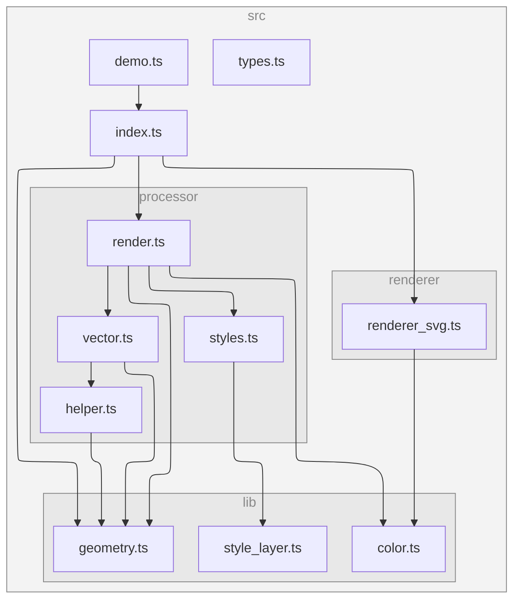

# VersaTiles SVG Renderer

Renders vector maps as SVG.

[Download SVG](docs/demo.svg)

Currently only background, fill and line layers are supported.

## E2E Visual Comparison

A visual comparison report between the SVG renderer and MapLibre GL JS is published to GitHub Pages:

[View Report](https://versatiles-org.github.io/versatiles-svg-renderer/report.html)

## Dependency Graph

<!--- This chapter is generated automatically --->

